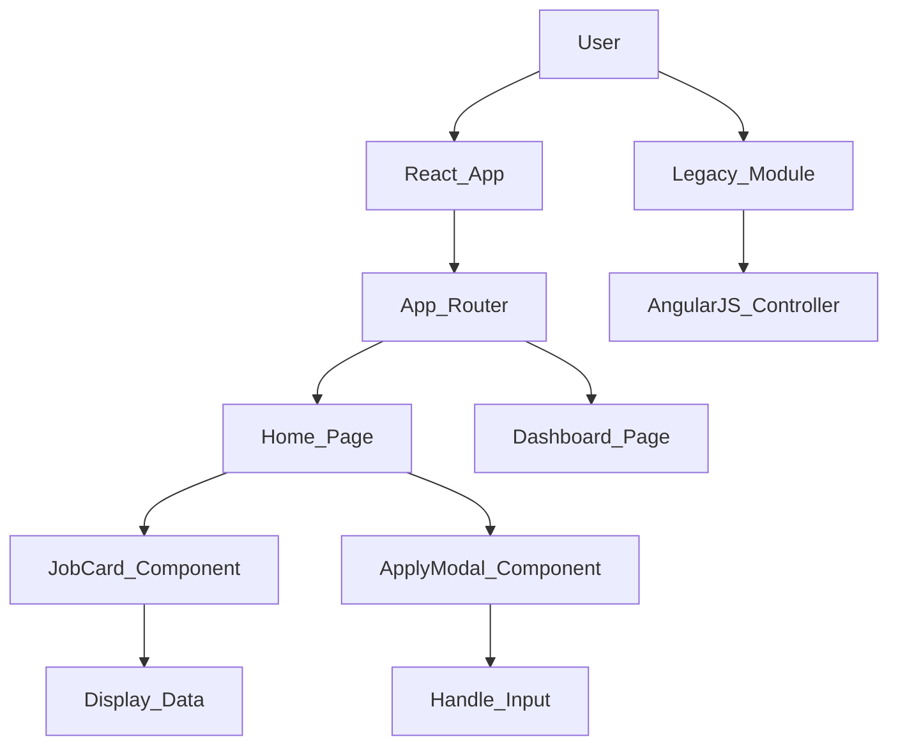

# HireSphere – Responsive Job Application Portal (Frontend)

## 🚀 Project Overview
HireSphere is a responsive job application portal frontend that allowing users to browse job listings, view details, and apply for positions. The project demonstrates a modern **React-based architecture** with **Bootstrap** for responsiveness, while also integrating a **legacy AngularJS module** to showcase adaptability to older systems.

### 🎯 Key Features
1. **Job Listings**: Dynamic grid display of available positions.
2. **Job Details & Application**: Modal-based application form with validation.
   - *Note: Resume upload simulates a file selection (PDF/DOC) without backend storage.*
3. **Dashboard**: Tracks applied jobs (using local storage).
4. **Responsive Design**: Fully mobile-compatible using Bootstrap 5.
5. **Legacy Module**: A standalone AngularJS 1.x page for administrative filtering.

---

## 🧰 Tech Stack
- **Frontend**: React.js (Vite), JavaScript (ES6+)
- **Styling**: Bootstrap 5, React-Bootstrap, Custom CSS
- **Routing**: React Router DOM v6
- **Legacy**: AngularJS 1.8.2
- **State Management**: React Hooks (useState, useEffect)

---

## 🏗️ Architecture


---

## 📂 Folder Structure
```
hiresphere/
├── public/
│   └── legacy/          # Independent AngularJS module
├── src/
│   ├── components/      # Reusable UI components
│   │   ├── Navbar.jsx
│   │   ├── JobCard.jsx
│   │   ├── JobList.jsx
│   │   ├── ApplyModal.jsx
│   │   └── Footer.jsx
│   ├── pages/           # Page views
│   │   ├── Home.jsx
│   │   └── Dashboard.jsx
│   ├── data/            # Mock JSON data
│   │   └── jobs.json
│   ├── styles/          # Custom styles
│   ├── App.jsx          # Main routing & state
│   └── main.jsx         # Entry point
└── README.md
```

---

## 🏃‍♀️ How to Run Locally

1. **Clone the repository** (or download source):
   ```bash
   git clone <repository-url>
   cd hiresphere
   ```

2. **Install dependencies**:
   ```bash
   npm install
   ```

3. **Start the development server**:
   ```bash
   npm run dev
   ```

4. **Open in browser**:
   - Modern App: `http://localhost:5173`
   - Legacy Module: `http://localhost:5173/legacy/index.html`

---

## 🧱 implementation Highlights (Interview Points)

### **SOLID Principles**
- **Single Responsibility (SRP)**: Each component does one thing (e.g., `JobCard` only displays card UI).
- **Open/Closed (OCP)**: Components are extensible via props without modification.
- **Interface Segregation (ISP)**: Components only receive necessary props.

### **Design Patterns**
- **Component-Based**: UI broke down into atomic pieces (Navbar, Card, Modal).
- **Container-Presentational**: `Home` manages state, while `JobList` and `JobCard` purely render UI.

### **Responsiveness**
- Utilized **Bootstrap Grid System** (`Row`, `Col`) and generic utility classes (`d-flex`, `text-center`) to ensure layout adapts from mobile to desktop.
- Used **Media Queries** in `custom.css` for fine-tuning.

---

## 📄 License
MIT License
